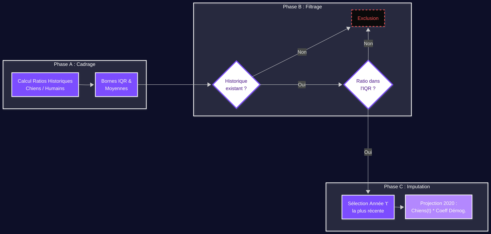

# Annexes

## Annexe 1 - Description des colonnes et variables du jeu de données ICAD

| Variable            | Description                                                                 |
|---------------------|-----------------------------------------------------------------------------|
| ID_GEOFLA           | Identifiant unique de la commune dans la base géographique.               |
| CODE_COMM           | Code de la commune.                                                        |
| INSEE_COM           | Code INSEE associé à chaque commune.                                       |
| NOM_COMM            | Nom de la commune.                                                         |
| STATUT              | Statut administratif de la commune (commune simple, chef-lieu, etc.).     |
| X_CHF_LIEU          | Coordonnée X du chef-lieu de la commune.                                   |
| Y_CHF_LIEU          | Coordonnée Y du chef-lieu de la commune.                                   |
| X_CENTROID          | Coordonnée X du centroïde de la commune.                                   |
| Y_CENTROID          | Coordonnée Y du centroïde de la commune.                                   |
| Z_MOYEN             | Altitude moyenne de la commune.                                           |
| SUPERFICIE          | Superficie de la commune.                                                  |
| CODE_CANT           | Code du canton auquel appartient la commune.                               |
| CODE_ARR            | Code de l’arrondissement.                                                  |
| CODE_DEPT           | Code du département.                                                       |
| NOM_DEPT            | Nom du département.                                                        |
| CODE_REG            | Code de la région.                                                         |
| NOM_REGION          | Nom de la région.                                                          |
| Ville_origine       | Indique la commune d’origine dans le cas de fusions ou de modifications administratives. |

**Typologie communes** : NaN

---

## Annexe 2 - Caractéristiques distinctives des communes à valeurs manquantes


Comparaison des caractéristiques (Médiane Standard vs Médiane NaN)


| Caractéristique                                      | Médiane Standard | Médiane NaN | Différence (%) |
|------------------------------------------------------|------------------|-------------|----------------|
| Z_MOYEN                                              | 175.000000       | 191.000     | +9.1%          |
| Part des maisons dans le total des logements 2022  | 93.700000        | 96.500      | +3.0%          |
| Médiane du revenu disponible par UC 2021             | 23130.000000     | 22850.000   | -1.2%          |
| Taille moyenne des ménages 2022                      | 2.300000         | 2.200       | -4.3%          |
| SUPERFICIE                                           | 1103.500000      | 894.000     | -19.0%         |
| Densité de population                                | 58.820000        | 26.465      | -55.0%         |
| Population humaine 2020                              | 669.000000       | 233.000     | -65.2%         |
| Part des surfaces artificialisées 2018               | 4.700000         | 1.400       | -70.2%         |

---

## Sous-déclaration


Comparaison des caractéristiques (Médiane Standard vs Sous-déclaration)


| Caractéristique                                      | Médiane Standard | Sous-déclaration | Différence (%) |
|------------------------------------------------------|------------------|------------------|----------------|
| Part des maisons (2022)                              | 93.7%            | 95.1%            | +1.5%          |
| Superficie (hectares)                                | 1 103.5          | 1 119.0          | +1.4%          |
| Densité de population                                | 58.82            | 59.44            | +1.1%          |
| Taille moyenne des ménages                           | 2.3              | 2.3              | 0.0%           |
| Revenu disponible médian (UC)                        | 23 130 €         | 23 000 €         | -0.6%          |
| Population Humaine (2020)                            | 669              | 649              | -3.0%          |
| Altitude Moyenne (Z)                                 | 175.0            | 165.0            | -5.7%          |
| Surfaces artificialisées                             | 4.7%             | 4.1%             | -12.8%         |
| Ratio Chiens / Humains (2020)                        | 0.21             | 0.003            | -98.4%         |

---

## Surtaxe refuge


Comparaison des caractéristiques (Médiane Standard vs Surtaxe refuge)


| Caractéristique                                      | Médiane Standard | Médiane Surtaxe | Différence (%) |
|------------------------------------------------------|------------------|-----------------|----------------|
| Superficie (hectares)                                | 1 103.5          | 1 357.0         | +23.0%         |
| Altitude Moyenne (Z)                                 | 175.0            | 204.0           | +16.6%         |
| Part des maisons (2022)                              | 93.7%            | 96.7%           | +3.2%          |
| Taille moyenne des ménages                           | 2.3              | 2.2             | -4.3%          |
| Revenu disponible médian (UC)                        | 23 130 €         | 21 870 €        | -5.4%          |
| Population Humaine (2020)                            | 669              | 303             | -54.7%         |
| Densité de population                                | 58.82            | 21.86           | -62.8%         |
| Surfaces artificialisées                             | 4.7%             | 1.1%            | -76.6%         |


### Diagrame algorithme de l'imputation temporelle



### parametrage Random Forest
```python
rf_final = RandomForestRegressor(
    n_estimators=500,
    max_depth=25,
    random_state=42,
    n_jobs=-1
)
```

## liens vers galerie

https://github.com/Hlkarim/Projet-tutore-Modelisation-predictive-de-la-population-canine-en-france-/blob/main/galerie.md
