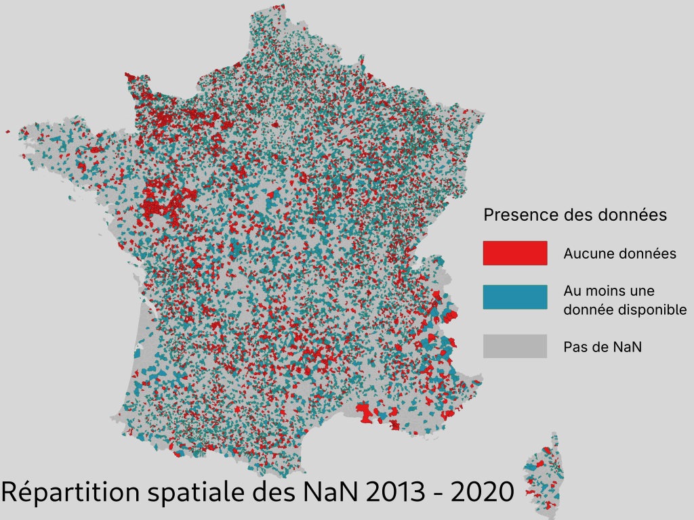
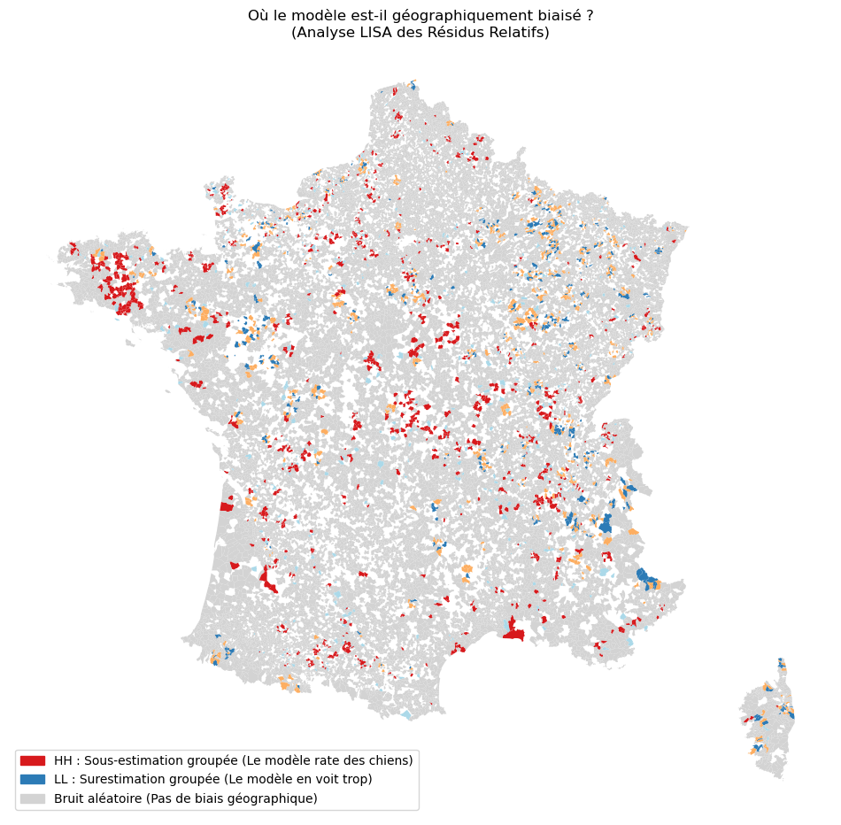
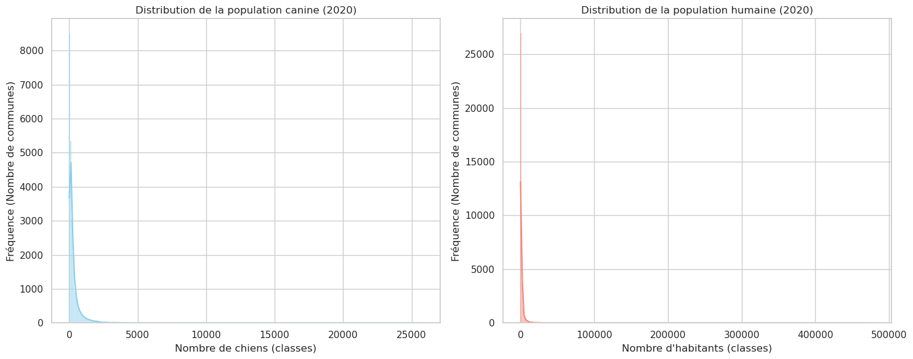
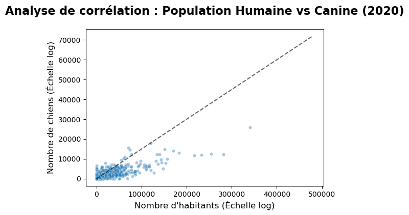
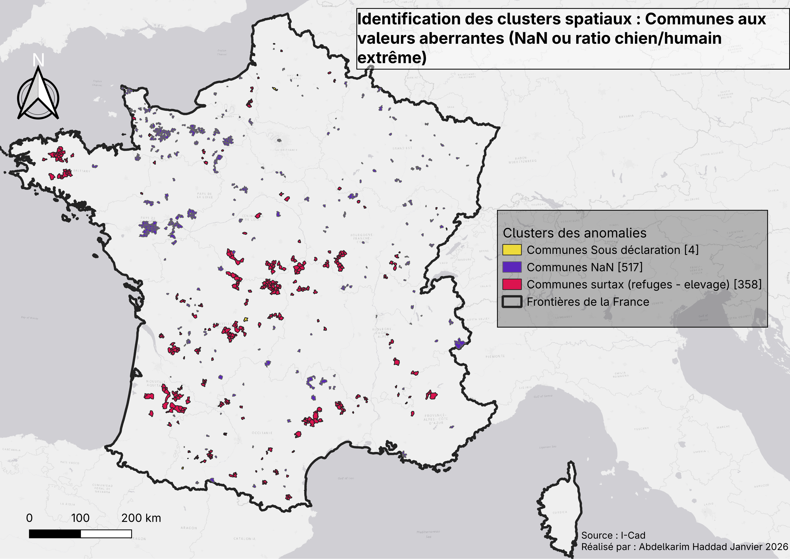

# 📊 Galerie des Graphiques — Projet Tutoré ICAD

Cette galerie présente les visualisations clés générées dans le cadre du **projet tutoré 53**, axé sur l'analyse des données ICAD, la gestion des valeurs manquantes (NaN), et la modélisation des résidus.

---

## 🔍 Analyse des Données et Valeurs Manquantes

Graphiques liés aux valeurs manquantes (NaN)

| Fichier                          | Description                                                                                     | Visualisation                                                                                     |
|----------------------------------|-------------------------------------------------------------------------------------------------|--------------------------------------------------------------------------------------------------|
| **all_nan++.png**                | Cartographie complète des communes avec des valeurs manquantes (version étendue).               |                                                           |
| **all_nan.png**                  | Cartographie des communes avec des valeurs manquantes (version standard).                        |                                                               |
| **Typologie_NaN.png**            | Typologie des communes selon leur taux de valeurs manquantes.                                   |                                                     |
| **typologie données nan pie.png** | Répartition des types de données manquantes (camembert).                                         |                                 |
| **évolution_NaN.png**            | Évolution temporelle des valeurs manquantes dans le jeu de données.                            |                                                   |
| **Completude_barre_plot.png**    | Taux de complétude des données par variable (barplot).                                          |                                               |

---

## 📈 Modélisation et Résidus

Graphiques liés à la modélisation et aux résidus

| Fichier                                      | Description                                                                                     | Visualisation                                                                                     |
|----------------------------------------------|-------------------------------------------------------------------------------------------------|--------------------------------------------------------------------------------------------------|
| **Distribution des residus.png**            | Distribution des résidus du modèle final (histogramme).                                         |                             |
| **Performance risidus modele final.png**     | Performance du modèle final (métriques : MAE, R²) basée sur les résidus.                      |                      |
| **risidues_map.png**                         | Cartographie spatiale des résidus du modèle.                                                    |                                                     |
| **lisa_residus.png**                         | Analyse LISA (Local Indicators of Spatial Association) des résidus.                              |                                                       |
| **moran_risidues_map.png**                   | Cartographie des résidus avec indice de Moran (autocorrélation spatiale).                       |                                                |
| **stabilité du modele MAE R².png**           | Stabilité du modèle (MAE et R²) sur différentes itérations.                                    |                         |

---

## 🐕👥 Analyse des Données "Chiens vs. Humains"

Graphiques liés à la distribution chiens/humains

| Fichier                                      | Description                                                                                     | Visualisation                                                                                     |
|----------------------------------------------|-------------------------------------------------------------------------------------------------|--------------------------------------------------------------------------------------------------|
| **distribution_pop_chien+humain.png**       | Distribution conjointe des populations de chiens et d'humains.                                |                      |
| **histo_dist_chien_hum.png**                 | Histogramme comparatif des distributions chiens/humains.                                       |                                                 |
| **scatter_chien_humain_log_clean.png**      | Nuage de points (logarithmique) : relation entre population canine et humaine.                 |                                      |
| **Scatter_plot_log_huma_chien.png**          | Nuage de points (logarithmique) : zoom sur les outliers.                                        |                                  |
| **scatter.png**                              | Nuage de points brut : chiens vs. humains.                                                     |                                                           |

---

## 🗺️ Clusters et Cartographie

Graphiques liés aux clusters et à la cartographie

| Fichier               | Description                                                                                     | Visualisation                                                                                     |
|-----------------------|-------------------------------------------------------------------------------------------------|--------------------------------------------------------------------------------------------------|
| **All_Clusters.png**  | Cartographie des clusters identifiés dans les données ICAD.                                    |                                                      |
| **imputation_temporelle.png** | Visualisation des résultats d'imputation temporelle des données manquantes.                   |                                    |

---

### 🔎 Légendes et Contexte
- **NaN** : Les graphiques liés aux valeurs manquantes (`all_nan++.png`, `Typologie_NaN.png`, etc.) illustrent la répartition géographique et typologique des données manquantes dans le jeu de données ICAD. Ces visualisations sont essentielles pour comprendre les biais potentiels et orienter les stratégies d'imputation.
- **Résidus** : Les graphiques de résidus (`Distribution des residus.png`, `risidues_map.png`) permettent d'évaluer la performance spatiale et statistique du modèle final. L'analyse LISA et Moran met en évidence les autocorrélations spatiales.
- **Chiens/Humains** : Les scatter plots et histogrammes explorent la relation entre les populations canines et humaines, avec une attention particulière aux outliers et aux distributions logarithmiques.
- **Clusters** : La carte `All_Clusters.png` montre les regroupements géographiques identifiés, utiles pour une analyse spatiale approfondie.

